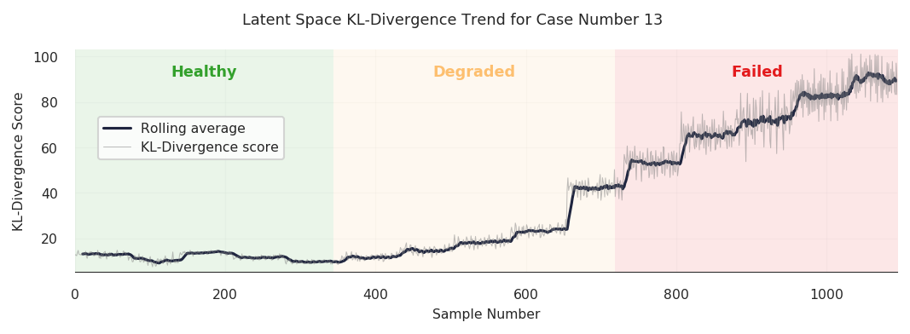
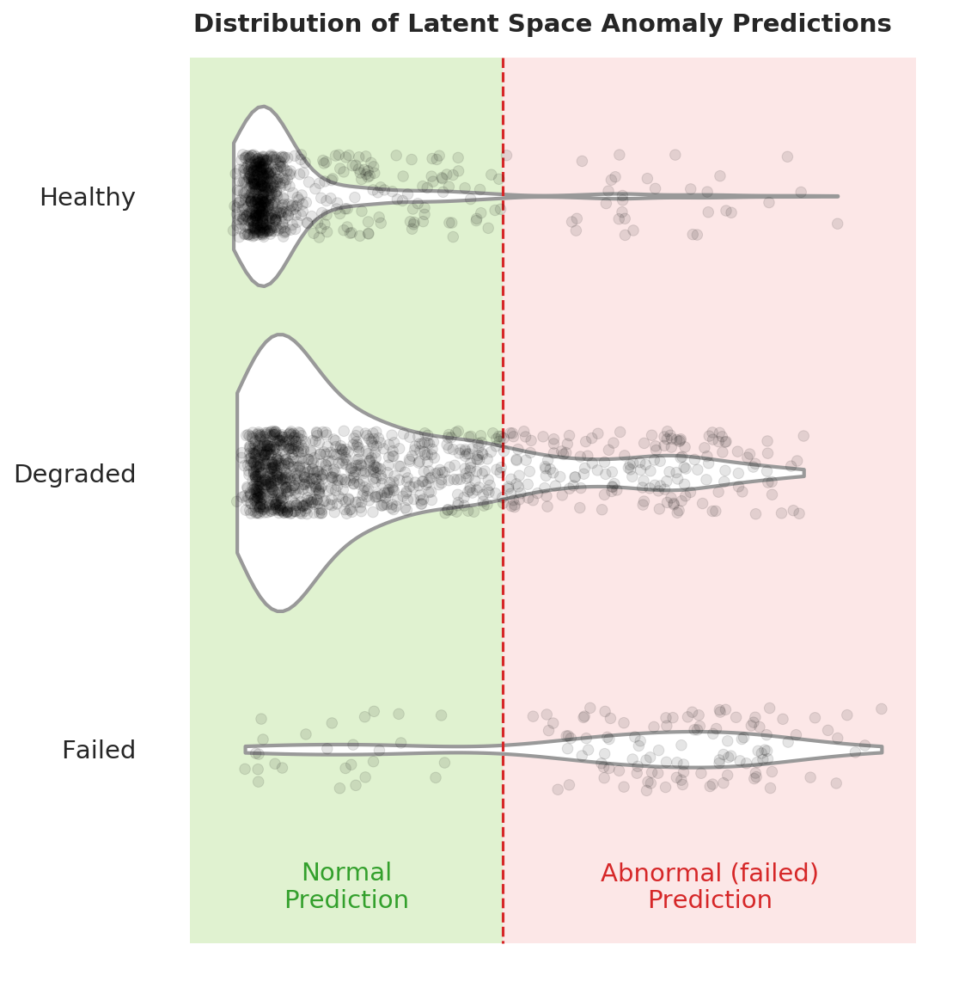
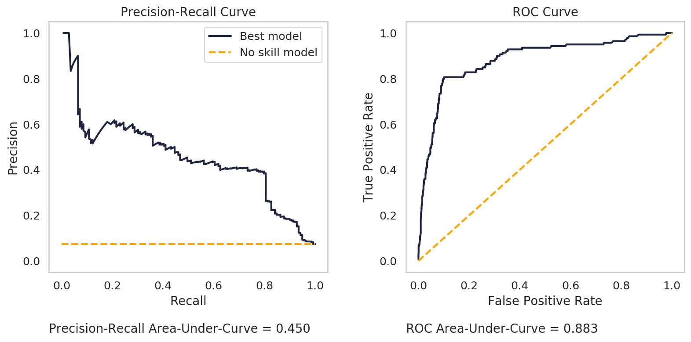
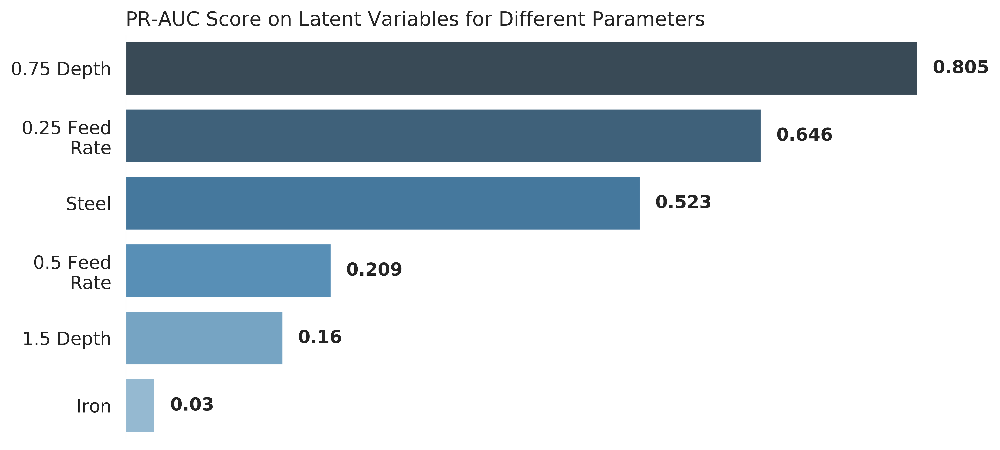
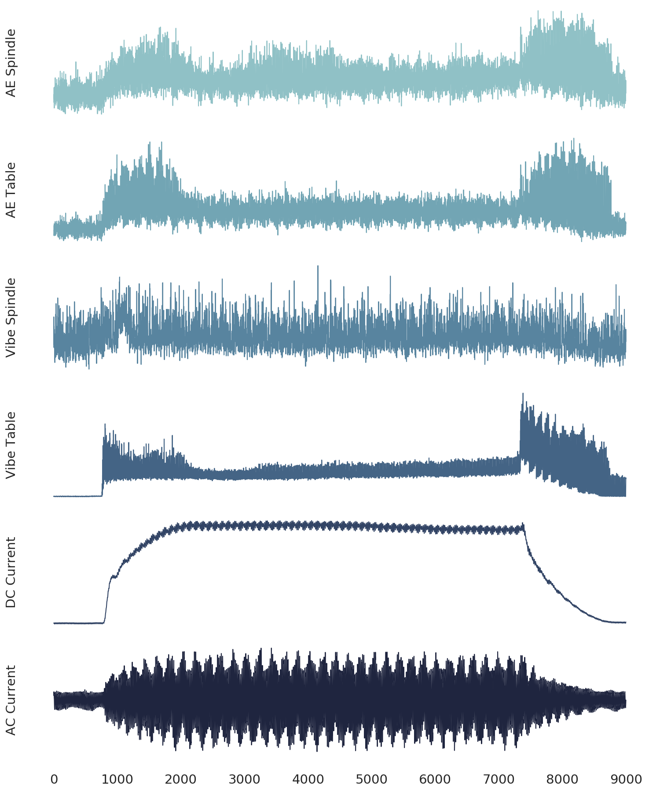

# Tool Wear Monitoring Using a Disentangled-Variational-Autoencoder and Anomaly Detection
Demonstration of anomaly detection on the [UC Berkeley milling data set](https://ti.arc.nasa.gov/tech/dash/groups/pcoe/prognostic-data-repository/) using a disentangled-variational-autoencoder (beta-VAE). The method is described in my MASc thesis, *Feature Engineering and End-to-End Deep Learning in Tool Wear Monitoring*.

## How to Run

[**milling-tool-wear-beta-vae.ipynb**](https://colab.research.google.com/github/tvhahn/ml-tool-wear/blob/master/milling-tool-wear-beta-vae.ipynb) is the notebook to replicate the results and make the figures. I recommend using google colab. The notebook is optimized for it, it will run in your browser, and no package installation required!

## Summary
A disentangled-variational-autoencoder, with a temporal convolutional neural network, was used to model and trend tool wear in a self-supervised manner. Anomaly detection was used to make predictions in both the input and latent spaces. The experiment was performed on the UC Berkeley milling data set. 

The method achieved a precision-recall area-under-curve (PR-AUC) score of 0.45 across all cutting parameters in the milling data set, and a top score of 0.80 for shallow depth cuts. The study presents the first use of a disentangled-variational-autoencoder for tool wear monitoring.

**Figure 1:** The tool wear trend for case 13, generated from the latent space.

**Figure 2:** The distribution of the test data samples in the latent space. The y-axis shows the true state of the data samples (either healthy, degraded, or failed) and the x-axis shows the anomaly predictions (either normal or abnormal). The dotted line represents a decision threshold. Each small grey dot represents one data sample.

    

**Figure 3:** The precision-recall curve (left) and the ROC curve (right) for the best model on the test data (using latent space anomaly detection). The no-skill model (equivalent to a random model) is plotted as a comparison. In the context of this experiment, precision is the proportion of abnormal predictions that are truly abnormal (the tool is in a failed state). Recall is the proportion of truly abnormal samples (failed) that were identified correctly.

    

**Figure 4:** The PR-AUC score in the latent space, while looking at one parameter in a pair at a time.

    

**Figure 5:** An example of one cut (out of 167) from the milling data set. Six signals are collected during each cut.

    

